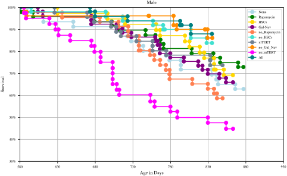
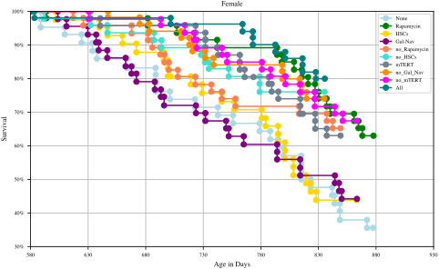

  <h1 align="center"> Predicting most Efficient Interventions for Life Span Increase</h1>
  
  

This repository contains the code which was used for the
Data Literacy Paper Project "Predicting most Efficient
Interventions for Life Span Increase".

---
## Directory Structure
- **dat** contains data files. The data from *final_datasets* was used for the analysis 
- **exp** contains the python notebooks for our analysis.
- **fig** contains the figures used for the analysis and the paper.
- **src** contains source code that we used for multiple notebooks. 

## Experiments
| Experiment                   | Description                                                                                                               |
|------------------------------|---------------------------------------------------------------------------------------------------------------------------|
| 001_GompertzAssumption       | Giving evidence to the assumption that the mortality rates of mice fit to the Gompertz-Makeham Law of Mortality.          |
| 002_ExtractingPointsFromPlot | Preprocessing of the manual elicited data points from the RMR reports.  Reproduction for the Figures in the README.md. |
| 003_MotivationalAnalysis     | We show that there has been a strong increase in scientific publications on the topic of ageing, particularly since 2015. |
| 004_ModelFitting             | Here we created multiple models to predict the best intervention combinations.                                            |

[//]: # (TODO: Add which experiment produced which Figure. Add to each experiment description " Reproduction for Figure X." if it contributes to one of the shown figures in the paper)
